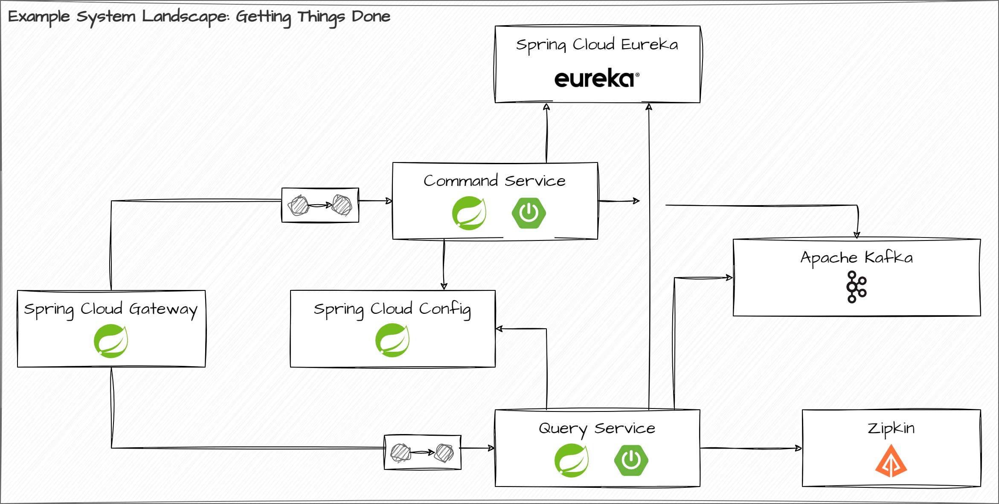

# Spring Cloud Demo

This repository sets up a Cloud-based system that uses Spring Cloud components to implement the following patterns:

* Discovery Service
* Edge Service
* Centralized Configuration Server

The components that we showcase in this demo are:

* Spring Cloud Netflix Eureka for the Discovery Service
* Spring Cloud Gateway for the Edge Service
* Spring Cloud Config for the Configuration Server

These Cloud components are integrated with an existing service landscape that implements a todo list application using multiple Spring Boot based services. The following illustration shows all infrastructure components and application services that participate in that system and sets them into relation.



## Building source code

The source material that we're working on comprises several Maven modules. Please make sure that everything compiles successfully. You'll find the top-level `pom.xml` at the root folder of the lab content. Issue a

```bash
$ mvn clean package
```

from within the root folder. This builds all the modules; the fat JARs for every module will be located at the `target` folder for each and every Maven module. Building the Docker images for our services relies on these JAR files, so make sure that you build the whole solution first before building the Docker images.

## Building Docker images

The source material that you're given features a `docker` folder. You'll find all the scripts for the assignment in that folder. To make sure that you've got all the required Docker images present on your system, we recommend that you start up the baseline scenario. This can be done by issuing

*Linux / MacOS*

```bash
$ cd docker
$ ./build-containers.sh
$ docker-compose up
```

*Windows*

```bash
$ cd docker
$ build-containers.bat
$ docker-compose up
```

This will launch a service instance of the command service and the query service, which both expose a public HTTP API that you work with. It also launches a small Kafka cluster consisting of a single broker. This is a requirement for the interoperability between the command service and the query service. Don't worry too much about that Kafka cluster - it needs to be there, but we won't work with it.

Please make sure that both services launch correctly and respond with their public API.

## Useful Links

All services are reachable through the edge service. Please have a look at the HTTP request definitions in file `http/requests.http` in order to access these services through the edge service.

The API specification of the application services is minimalistic. Check their OpenAPI UI and play around with it for a bit to get familiar with the todo list application. The list underneath holds a couple of useful links to get you started.

* [OpenAPI UI for the Command Service](http://localhost:8080/command-service/openapi/swagger-ui.html)
* [OpenAPI UI for the Query Service](http://localhost:8080/query-service/openapi/swagger-ui.html)
* [Eureka Dashboard](http://localhost:8080/eureka/web)
* [Config Server API](http://localhost:8080/config) - add `/{application}/{profile}` to fetch the configuration for a specific application given a specific profile

### Important Notes

The edge service uses a Resilience4j powered circuit breaker for the route to the command service. So if you terminate the command service and try to access it through the edge service, you should see the fallback mechanism do its work until the command service comes back up. **Please note that this can take a couple of seconds after the command service comes back up and registers itself with the discovery service, as the circuit breaker is likely closed.** The example showcases the circuit breaker applied to a route for HTTP POST requests. As POST requests are generally not idempotent and the circuit breaker will probe the target system, you can alter state by accident that you didn't want to alter at all.

The edge service uses a (not production-ready!) rate limiting strategy that kicks in very early. So, if you exceed a certain threshold of requests per time, the edge service will respond with a `429 Too Many Requests` until the rate limiter lets requests pass through again.

The config server is integrated with the command service. Since every service launches in parallel when started the whole system using Docker Compose, the command service will fail to execute the *Discovery First Bootstrap* mechanism and terminate itself. Just let the system come up anyway, exercise the circuit breaker if you want to, and then start the command service up afterwards by issuing the following command:

```bash
$ docker-compose up -d --scale command-service=1
```

This will bring up the command service, and since the config server is locatable through the discovery service by that point in time, it should be able to execute the *Discovery First Bootstrap* protocol and correctly fetch its configuration from the config server.

### Docker CLI Hints

*Starting containers using `docker-compose`*

```bash
$ docker-compose up
```

*Stopping containers using `docker-compose`*

```bash
$ docker-compose stop
```

*Removing containers using `docker-compose`*

```bash
$ docker-compose rm -f
```
